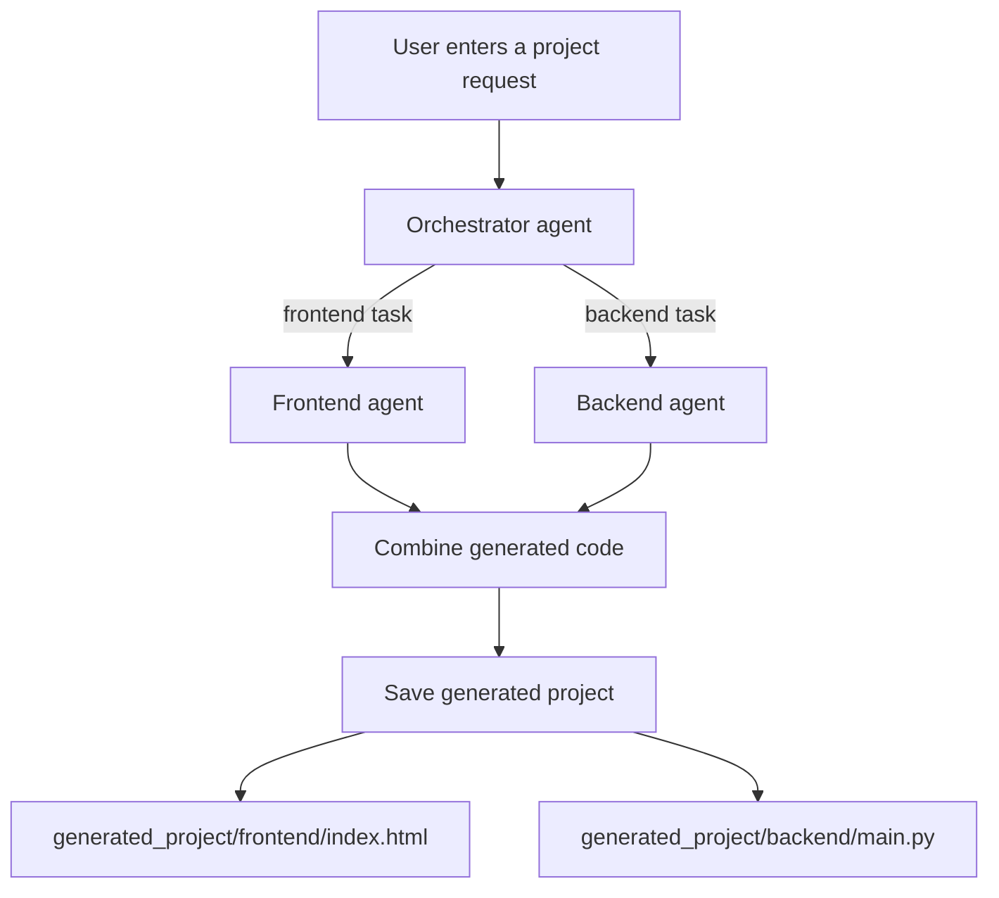

# Full-Stack AI Generator

An agent-based Python application that turns a product request into separate frontend and backend starter files. LangGraph coordinates a planning agent with frontend and backend code-generation agents.

## Workflow



## Project structure

```text
.
|-- agents/
|   |-- frontend_agent.py     # Generates a complete HTML document
|   `-- backend_agent.py      # Generates a FastAPI application
|-- orchestrator.py           # Splits a request into frontend/backend tasks
|-- state.py                  # Shared LangGraph state
|-- main.py                   # Builds and runs the workflow
|-- requirements.txt
`-- generated_project/        # Created after a run; ignored by Git
    |-- frontend/index.html
    `-- backend/main.py
```

## Setup

Prerequisites: Python 3.10+ and a Gemini API key.

```bash
git clone https://github.com/raunak076/Full-Stack-AI.git
cd Full-Stack-AI
python -m venv .venv
```

Activate the virtual environment:

```powershell
# Windows PowerShell
.\.venv\Scripts\Activate.ps1
```

```bash
# macOS/Linux
source .venv/bin/activate
```

Install dependencies and create a `.env` file:

```bash
pip install -r requirements.txt
```

```env
GEMINI_API_KEY=your_gemini_api_key_here
```

## Run

```bash
python main.py
```

Enter a request, for example:

```text
Build a task manager with user login and a REST API.
```

The workflow runs the frontend and backend agents in parallel, prints their generated code, and writes it to:

- `generated_project/frontend/index.html`
- `generated_project/backend/main.py`

The `generated_project` directory is overwritten on later runs and is intentionally excluded from Git so generated code does not mix with the generator source.

## Notes

- Keep `.env` private. It is ignored by Git.
- Generated code is a starting point; review it, test it, and add production security controls before deployment.
- The frontend agent returns one standalone HTML file with embedded CSS and JavaScript. The backend agent returns one FastAPI `main.py` file.
